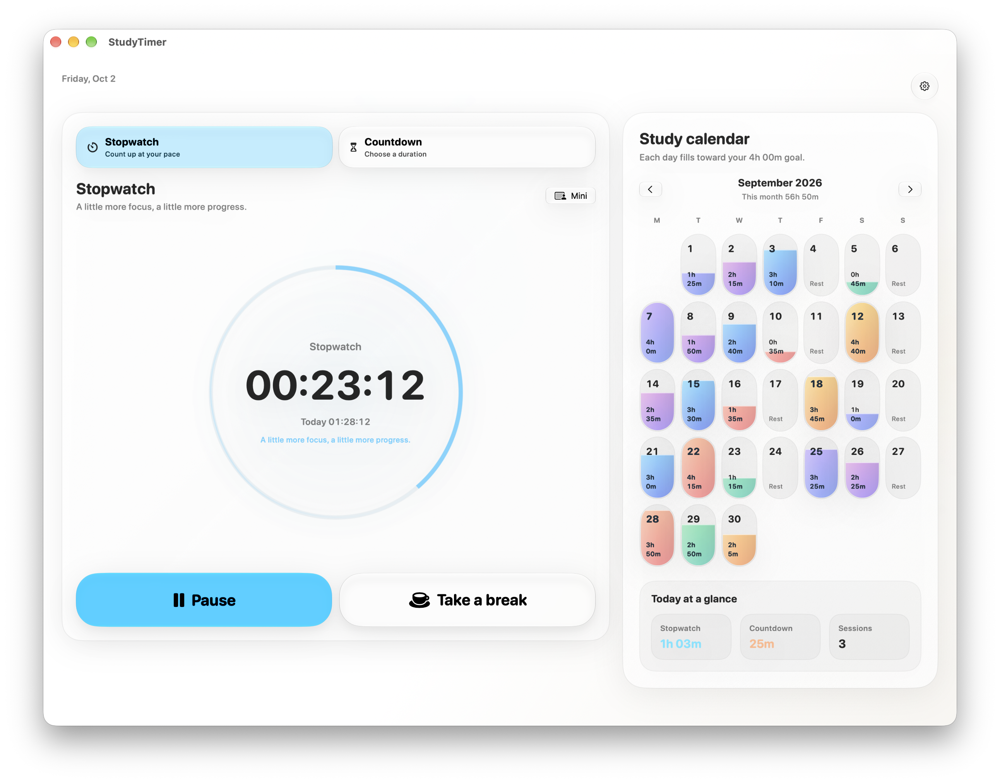
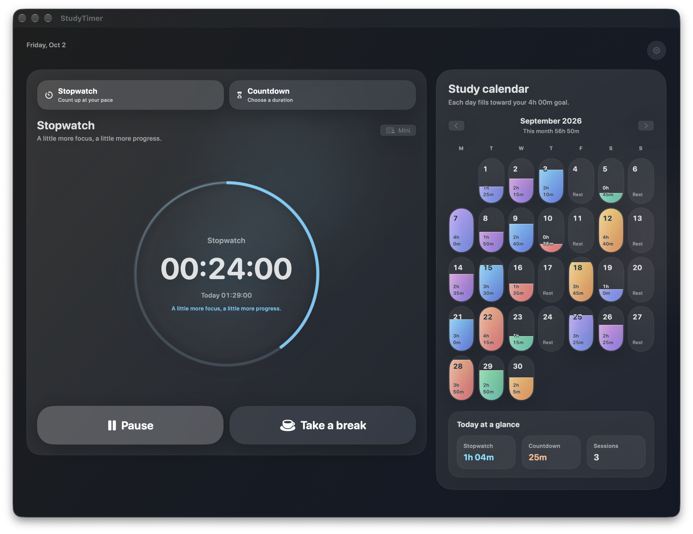
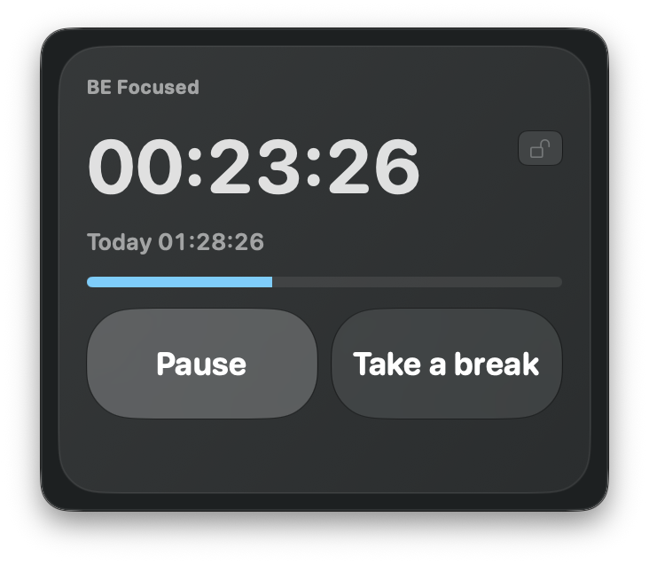
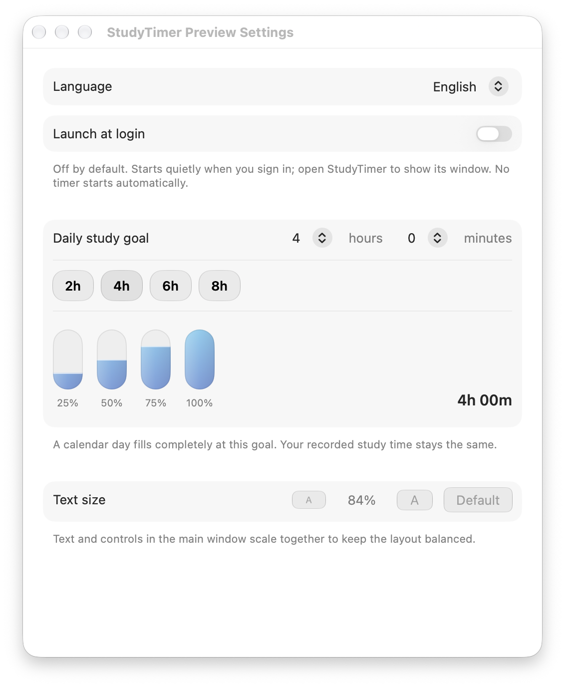

<h1 align="center">StudyTimer</h1>

<strong>A native macOS study timer that makes focused time visible.</strong>

A flowing time ring, a quiet mini window, and a calendar that fills as you study.

  <a href="https://github.com/B0yangWong/StudyTimer-Releases/releases/latest">Download</a> |
  <a href="#features">Features</a> |
  <a href="PRIVACY.md">Privacy</a> |
  <a href="README.zh-CN.md">中文说明</a>

---

This repository hosts downloads, documentation, and synthetic demo images. Application source remains private.

**0.1.1 preview:** Apple silicon Macs, macOS 15 or later. The app is ad hoc signed, not Developer ID signed or notarized by Apple. macOS may block the first launch. This is not an Apple-reviewed release. Older supported macOS versions and a clean-Mac download/login flow have not yet been fully tested.

## Features

| Feature | What it does |
| --- | --- |
| Stopwatch and countdown | Start at your pace or choose 5 minutes to 4 hours. Pause and resume without losing recorded study time. |
| Shared daily total | Main and mini windows combine stopwatch and study-countdown time. New breaks are excluded. |
| Daily-goal calendar | Set your goal in hours and minutes. Precise liquid fill follows its percentage; dates and time labels stay readable. |
| Quiet mini window | Compact controls, pinning, hidden window chrome, and a gentle countdown-completion reminder. |
| Flowing ring and native glass | The previous completed hour stays as a full ring while the next color advances over it. Rim-only motion and Apple's Liquid Glass controls on macOS 26+. |
| English and Chinese | Change language and content size in Settings. |
| Optional launch at login | Off for new installs. Enable it in Settings; login launch stays in the background with no automatic timer start. |
| Local-first | No app account, analytics, cloud sync, or automatic update checks. |

## Preview

These window screenshots use the production views with isolated, synthetic study history. They are not personal records or performance measurements.

Dark appearance

Settings

Completed-hour ring

This is a production Metal-renderer preview at one and a half hours: red progress advances over the completed blue base ring.

## Install and Open

1. Download `StudyTimer-0.1.1-macOS-arm64.zip` from [Releases](https://github.com/B0yangWong/StudyTimer-Releases/releases/latest).
2. Extract the archive and move `StudyTimer.app` into `/Applications` or your home `Applications` folder. Quit an older copy normally before replacing it.
3. Open StudyTimer. If macOS blocks it, review the source of the download and decide whether to trust it. Any exception must be made manually using [Apple's instructions](https://support.apple.com/guide/mac-help/open-a-mac-app-from-an-unknown-developer-mh40616/mac). Do not disable Gatekeeper globally or use a quarantine-removal script.
4. Open Settings to choose your daily goal, language, content size, and optional launch at login.

The release includes `SHA256SUMS.txt`; compare it with the downloaded archive before installation. A matching checksum checks the file against this release, not Apple approval or publisher identity.

Launch at login uses macOS system-managed login items and may require approval in System Settings. It does not add a menu-bar icon or start a new timer. Open the app normally to show its window. If you used an older build with a StudyTimer login agent, the switch reflects that item; changing it removes or replaces only the recognized StudyTimer entry. Turn launch at login off before uninstalling.

## Everyday Controls

| Action | Shortcut |
| --- | --- |
| Start, pause, or resume | `Command + Shift + Space` while StudyTimer is active |
| Reset | `Command + Shift + R` |
| Open mini window | `Command + Shift + M` |
| Open main window | `Command + Shift + 1` |
| Settings | `Command + ,` |

Normal quit saves and pauses the timer. Sleep pauses an active timer; waking resumes it if it was running. Force quitting or losing power is not equivalent to normal quit.

## Privacy and Limits

Study history stays in `~/Library/Application Support/StudyTimer/sessions.json`; it is not uploaded to GitHub. The app does not independently encrypt, back up, or sync it. See [Privacy](PRIVACY.md).

Only Apple silicon is packaged. Version 0.1.1 was checked on macOS 27, not every supported Mac. Automated tests cover timer accounting, rendering, settings, and login-item state/errors; real reboot/login, older macOS, and clean-Mac security prompts still need hands-on validation. Previous countdown records cannot safely distinguish breaks, so historical totals are preserved. New breaks are excluded.

Updates are manual. Download a newer release, quit normally, and replace the app without deleting its Application Support folder. Report issues here with your macOS version and reproduction steps; never upload private study history.

## Credits

The Metal ring uses a technique adapted from Paul Hudson and the Inferno contributors; its MIT notice is included in the app. See [third-party notices](THIRD_PARTY_NOTICES.md). The application is not open source; this download repository does not publish its source or grant an open-source license to the app or icon artwork.
